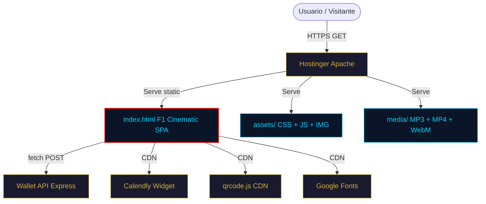
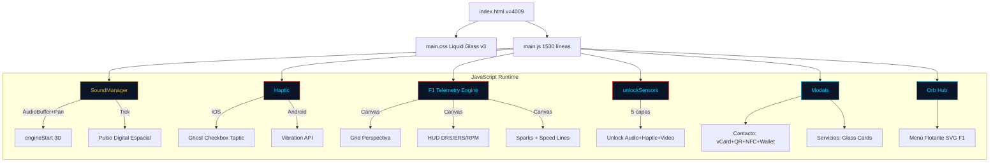

# SOFTWARE ARCHITECTURE DOCUMENT (SAD)
## Firma Digital Sentinel — F1 Cinematic v4.1

**Versión:** 4.1.0-MASTER | **Build:** 4009 | **Fecha:** 27 Mayo 2026  
**Autor:** Equipo Orion / Juan Carlos Izquierdo González  
**Sincronizado con:** [README.md](./README.md) • [SAD-Lite.md](./SAD-Lite.md) • [Developer-Handbook.md](./Developer-Handbook.md) • [BACKLOG-HU.md](./BACKLOG-HU.md)

---

## 0. Propósito y Control Documental

El presente **SAD (Software Architecture Document)** es la fuente canónica de verdad arquitectónica para el ecosistema **Firma Digital Sentinel — F1 Cinematic v4.1**. Define el stack tecnológico, la arquitectura de módulos, el diseño de seguridad, y las decisiones de ingeniería que gobiernan el sistema.

Este documento está sincronizado con:
- [SAD-Lite.md](./SAD-Lite.md): Resumen ejecutivo para stakeholders no técnicos
- [Developer-Handbook.md](./Developer-Handbook.md): Recetas de código, patrones y convenciones
- [BACKLOG-HU.md](./BACKLOG-HU.md): Historias de usuario en formato Golden Template
- [README.md](./README.md): Índice maestro y guía de referencia rápida

**Política de Sincronización:** Toda modificación arquitectónica se registra primero en este SAD y se propaga a los documentos satélite. El SAD es la fuente única de verdad.

---

## 1. Stack Tecnológico

| Capa | Tecnología | Versión | Justificación |
|------|------------|---------|---------------|
| **Core** | HTML5 Semántico + ES6+ JavaScript | — | Zero dependencias. Sin frameworks, sin npm, sin node_modules |
| **Estética** | CSS3 Custom Properties + Liquid Glass v3 | — | Paleta F1 Racing: Navy `#0A1628`, Red `#E10600`, Cyan `#00D2FF`, Gold `#D4AF37` |
| **Motor Visual** | Canvas 2D API | — | F1 Telemetry Engine V3: grid perspectiva, HUD broadcast, DRS/ERS, chispas, speed lines |
| **Audio** | Web Audio API + AudioBufferSourceNode | — | Sample real `f1-engine.mp3` cargado en memoria. `StereoPannerNode` para paneo 3D. `DelayNode` para reverb sintética |
| **Hápticos iOS** | Taptic Engine via Ghost Checkbox | Safari 17.4+ | `<input type="checkbox" switch>` + `label.click()` con `stopPropagation` |
| **Hápticos Android** | Vibration API | — | `navigator.vibrate()` protegido por flag `_unlocked` |
| **Servidor** | Apache/LiteSpeed | — | `.htaccess` con CSP canónica, HTTPS redirect, cache headers |
| **Build** | Node.js `build.js` | — | Copia directa + gate de seguridad sintáctico |

---

## 2. Diagrama de Contenedores (C4 Nivel 1)



---

## 3. Diagrama de Runtime (Nivel 2)



---

## 4. Matriz de Componentes y Capas

| Capa | Componente | Archivo | Responsabilidad |
|------|-----------|---------|-----------------|
| **Frontend** | `index.html` | `index.html` | Punto de entrada, loader, ghost haptic elements, estructura DOM |
| **Frontend** | `main.css` | `assets/css/main.css` | Estilos Liquid Glass v3, paleta F1, animaciones, responsive |
| **Frontend** | `main.js` | `assets/js/main.js` | SoundManager, Haptic, F1 Telemetry, unlockSensors, modales, contacto |
| **Media** | `f1-engine.mp3` | `media/f1-engine.mp3` | Sample real de motor F1 (85 KB) |
| **Media** | `f1-bg.webm` | `media/f1-bg.webm` | Video cinemático de fondo F1 |
| **Media** | `1.mp4` | `media/1.mp4` | Video hero avatar |
| **Infra** | `.htaccess` | `.htaccess` | CSP, HTTPS, cache, compresión |
| **Infra** | `robots.txt` | `robots.txt` | Directivas SEO |
| **Build** | `build.js` | `build.js` | Gate de seguridad + empaquetado ZIP |

---

## 5. Arquitectura de Módulos

### 5.1 SoundManager (Audio 3D + Síntesis)

**Propósito:** Gestionar todo el audio del sistema: motor F1, ticks de scroll, sonidos UI.

**Responsabilidades:**
- Crear y gestionar el `AudioContext` bajo políticas W3C de autoplay
- Cargar `f1-engine.mp3` en memoria como `AudioBuffer` para reproducción sin latencia
- Sintetizar ticks de scroll con "Pulso Digital Espacial" (ondas sine, stereo spread, reverb)
- Sintetizar sonidos UI (click, open, close, hum)
- Aplicar paneo 3D estéreo mediante `StereoPannerNode`
- Proteger contra unlock prematuro mediante 5 capas de defensa

**Interfaces:**
- `SoundManager.unlock()` → Promise — Resume AudioContext tras gesto de usuario
- `SoundManager.loadF1Sample()` → Promise — Carga MP3 en memoria
- `SoundManager.engineStart()` → void — Reproduce motor con paneo 3D
- `SoundManager.tick(mode)` → void — Tick de scroll según modo (1=GLIDE, 2=RACE, 3=OVERTAKE)
- `SoundManager.getContext()` → AudioContext|null — Obtiene contexto si está desbloqueado
- `SoundManager.click() / open() / close() / hum()` → void — Sonidos UI

**No es su responsabilidad:** Vibración (Haptic), renderizado visual (F1 Telemetry), gestión de eventos DOM.

### 5.2 Haptic (Vibración Multi-Plataforma)

**Propósito:** Proporcionar feedback háptico en iOS y Android durante scroll e interacciones.

**Responsabilidades:**
- iOS: Disparar el Taptic Engine mediante `label.click()` sobre ghost checkbox nativo
- Android: Llamar a `navigator.vibrate()` con patrones según el modo de interacción
- Proteger contra unlock prematuro: `stopPropagation` + flag `_programmaticClick`
- Rate-limit: 40ms entre disparos hápticos

**Interfaces:**
- `Haptic.unlock()` → void — Activa el sistema de vibración
- `Haptic.tap()` → void — Vibración ligera (15ms)
- `Haptic.scrollTick()` → void — Vibración de scroll (25ms)
- `Haptic.medium()` → void — Vibración media (40ms, doble tap en iOS)
- `Haptic.success()` → void — Vibración triple ([30,50,30] Android, triple tap iOS)

### 5.3 F1 Telemetry Engine V3 (Canvas Visual)

**Propósito:** Renderizar el fondo interactivo con temática de telemetría F1.

**Responsabilidades:**
- Grid de perspectiva con punto de fuga dinámico (responde al giroscopio)
- HUD broadcast: brackets esquineros, indicadores DRS/ERS, barra de sector
- RPM bar sincronizada con velocidad de scroll
- Chispas (sparks): pool pre-alocado de 50 partículas emitidas en modo OVERTAKE
- Speed lines: 30 líneas de velocidad en modos RACE y OVERTAKE
- Data stream: sector activo (S1 Auditoría / S2 Arquitectura / S3 Talento)

**Propiedades:**
- `window.F1Telemetry.setScrollProgress(0-1)` — Actualiza progreso de scroll
- `window.F1Telemetry.setVelocity(px/ms)` — Dispara chispas según velocidad

### 5.4 unlockSensors (Desbloqueo Sensorial)

**Propósito:** Activar audio, haptic y video en el primer gesto real del usuario.

**Secuencia de ejecución:**
1. Verificar 5 capas de defensa (evento real, no programático)
2. `await SoundManager.unlock()` — Resume AudioContext
3. `await SoundManager.loadF1Sample()` — Carga buffer de audio
4. `Haptic.unlock()` — Activa vibración
5. `SoundManager.engineStart()` — Reproduce motor con paneo 3D
6. `Haptic.success()` — Triple vibración de confirmación
7. `video.play()` — Arranca video hero

**5 capas de defensa:**
| # | Mecanismo | Qué previene |
|---|-----------|-------------|
| 1 | `stopPropagation` en label | Click háptico no burbujea al document |
| 2 | Flag `Haptic._programmaticClick` | Rechaza origen sintético |
| 3 | `event.isTrusted` | Rechaza eventos fabricados por script |
| 4 | `removeEventListener` manual | Early-return no consume listeners |
| 5 | Solo `click` y `keydown` | `touchstart` no es gesto válido |

### 5.5 Scroll Mecánico (initScrollFeedback)

**Propósito:** Convertir el scroll en una experiencia sensorial multi-modo F1.

**Funcionamiento:**
1. Acumula delta de píxeles cada frame de scroll
2. Cada 40px acumulados: calcula velocidad (`px/ms`)
3. Clasifica en 3 modos: GLIDE (<0.8), RACE (0.8-2.0), OVERTAKE (>2.0)
4. Dispara audio, haptic y canvas según modo
5. Rate-limit: 150ms entre ticks

| Modo | Velocidad | Audio | Haptic | Visual |
|------|-----------|-------|--------|--------|
| GLIDE | <0.8 px/ms | Mi 660Hz | 1 tap | RPM baja |
| RACE | 0.8-2.0 | Sol 784Hz | 2 taps | Speed lines |
| OVERTAKE | >2.0 | Do 1047Hz | 3 taps + shake | Sparks + flash |

---

## 6. Diseño de Seguridad

### 6.1 Content Security Policy (CSP)

Fuente canónica: `.htaccess` (no meta tags en HTML).

```
Header set Content-Security-Policy "default-src 'self'; script-src 'self' cdn.jsdelivr.net assets.calendly.com; style-src 'self' 'unsafe-inline' fonts.googleapis.com; font-src 'self' fonts.gstatic.com; img-src 'self' data:; media-src 'self'; connect-src 'self' https://api.themisbynexus.com; frame-src 'self' calendly.com; object-src 'none'; base-uri 'self'"
```

### 6.2 Anti-Bot (3 Capas)
1. **robots.txt:** Bloquea indexación de `/assets/js/`, `/assets/css/`, `/media/`
2. **X-Frame-Options:** `SAMEORIGIN` — anti-clickjacking
3. **Permissions Policy:** Cámara y micrófono deshabilitados

### 6.3 Anti-Hacking
- **Zero Dependencies:** Sin npm, sin node_modules, sin riesgo supply-chain
- **Build Gate:** `new Function(mainJsContent)` aborta build si hay error de sintaxis
- **Ofuscación de Contacto:** Teléfono y email ofuscados en JS runtime

---

## 7. Arquitectura de Despliegue

```
Desarrollo (localhost:8080)
  │
  ├── node -c assets/js/main.js     ← Validación sintáctica
  ├── node build.js                 ← Gate de seguridad + empaquetado
  │     ├── Copia index.html + assets/ + media/
  │     ├── Verifica: sin debug, sin email antiguo
  │     └── new Function(mainJs)   ← Aborta si error
  │
  └── FirmaDigital_v4.1_F1Cinematic.zip (~10 MB)
        │
        └── Hostinger public_html/
              ├── index.html (v=4009)
              ├── .htaccess (CSP canónica)
              ├── assets/css/main.css
              ├── assets/js/main.js
              ├── assets/img/*.webp
              └── media/*.mp3, *.mp4, *.webm
```

---

## 8. Modos de Scroll (F1 Telemetry)

| Modo | Velocidad (px/ms) | Frecuencia Audio | Onda | Volumen | Duración | Haptic |
|------|-------------------|-----------------|------|---------|----------|--------|
| **GLIDE** | < 0.8 | 660Hz (Mi) ±3Hz | Sine | 1.0% | 150ms | 1 tap |
| **RACE** | 0.8 – 2.0 | 784Hz (Sol) ±3Hz | Sine | 1.5% | 150ms | 2 taps |
| **OVERTAKE** | > 2.0 | 1047Hz (Do) ±3Hz | Sine | 2.0% | 150ms | 3 taps |

---

## 9. Métricas y Rendimiento

| Métrica | Objetivo | Estado |
|---------|----------|--------|
| LCP (Lighthouse Mobile 4G) | < 2.5s | ⚠️ Pendiente remedición |
| FPS Canvas | 60 estables | ✅ |
| Audio Engine Start | < 100ms post-unlock | ✅ |
| Audio Scroll Tick | < 10ms latencia | ✅ |
| Osciladores máximos | 3 por tick + delay | ✅ |
| Consola | 0 errores, 0 warnings | ✅ |
| ZIP producción | < 15 MB | ✅ (~10 MB) |
| Cache busting | ?v=4009 | ✅ |

---

## 10. Registro de Decisiones Arquitectónicas (ADR)

### ADR-01: Canvas Hero vs Video Hero
**Decisión:** Mantener motor visual basado en Canvas (F1 Telemetry Engine V3) sobre video de fondo.  
**Justificación:** LCP excluido del canvas (z-index negativo), interactividad con giroscopio, zero assets descargables.

### ADR-02: Bypass Sensorial iOS + Defensa Multi-Capa
**Decisión:** Ghost checkbox `<input type="checkbox" switch>` + `label.click()` con `stopPropagation` y 5 capas de defensa en `unlockSensors`.  
**Justificación:** Único mecanismo que dispara Taptic Engine en Safari iOS. Aislamiento de eventos previene colisiones.

### ADR-03: AudioBuffer 3D + Pulso Digital Espacial
**Decisión:** `AudioBufferSourceNode` para engine start. Ondas sine puras con notas musicales y reverb sintética para scroll ticks.  
**Justificación:** Latencia cero, paneo 3D, experiencia no fatigante. Elimina sintetizadores sawtooth/square agresivos.

---

## 11. Dependencia entre Documentos

```
SAD.md (Arquitectura)
  ├── SAD-Lite.md (Resumen ejecutivo)
  ├── Developer-Handbook.md (Patrones y código)
  ├── BACKLOG-HU.md (Historias de usuario)
  └── README.md (Índice maestro)
```

---

## 12. Backlog de Épicas

| Épica | Sprint | Historias | Estado |
|-------|--------|-----------|--------|
| EP-01: Golden Master + Frente 2 | v3.1 | HU-01 a HU-05 | ✅ Completado |
| EP-02: Estabilización Post-Frente 2 | v3.3 | HU-06 a HU-10 | ✅ Completado |
| EP-03: Haptic + Scroll/Modal v2 | v3.4 | HU-11 a HU-15 | ✅ Completado |
| EP-04: Documentación + F1 bg video | v4.0 | HU-16 a HU-20 | ✅ Completado |
| EP-05: Audio 3D + Pulso Digital + Docs | v4.1 | HU-21 a HU-26 | ✅ Completado |

---

*Firma: [Arquitecto] Equipo Orion, 27 Mayo 2026*
