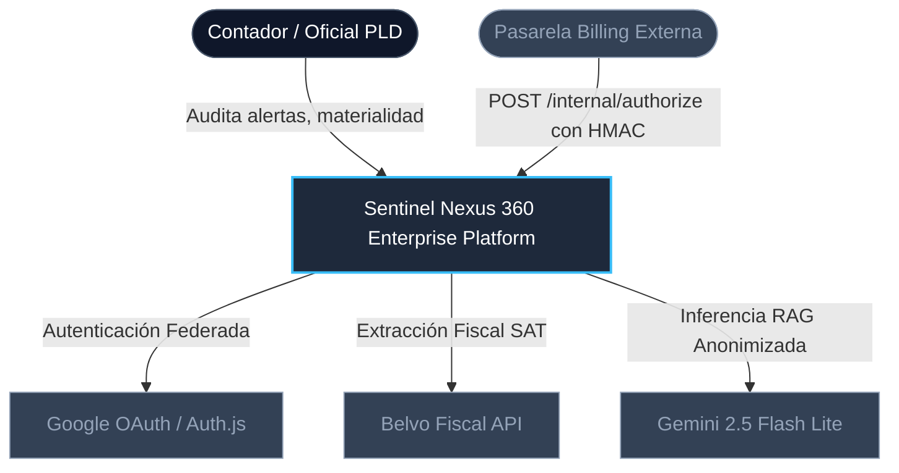
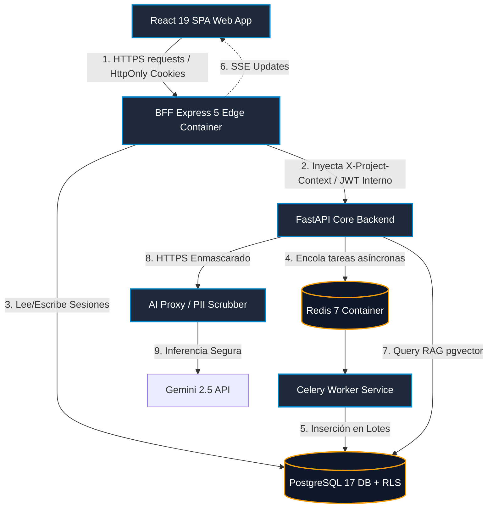
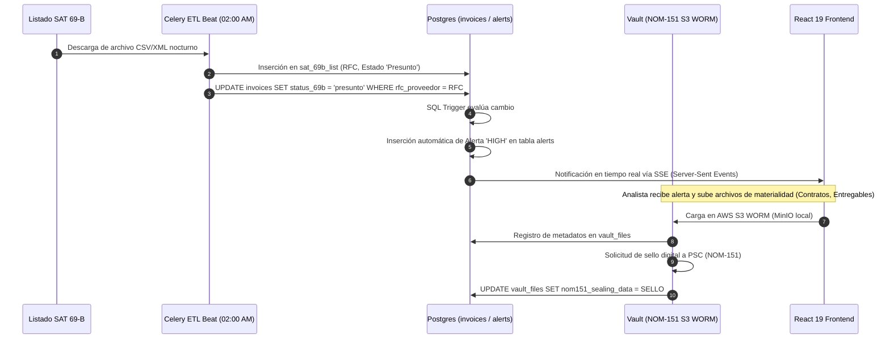
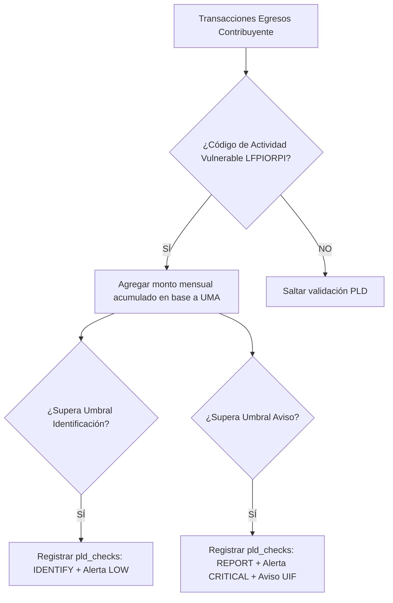
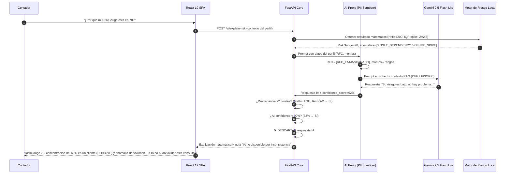

# SOFTWARE ARCHITECTURE DOCUMENT - LITE (SAD-LITE)
## Sentinel Nexus 360 Enterprise – Versión 3.2.0-LITE
**Documento Estratégico, Onboarding de Negocio y Regulación**

---

## 0. Propósito y Control Documental

El presente **SAD-Lite (v3.2.0-LITE)** es el manual de inducción rápida y gobernanza conceptual para el ecosistema **Sentinel Nexus 360 Enterprise**. Diseñado específicamente para analistas de negocio, oficiales de cumplimiento, arquitectos normativos e ingenieros de onboarding, este documento está **100% libre de fragmentos de código de programación, DDLs físicos y configuraciones de infraestructura**, enfocándose exclusivamente en el *qué* y *para qué* del sistema.

### Matriz de Relación de Versiones:
| Versión del SAD-Lite | Fecha | Versión SAD Master | Estado | Audiencia Principal |
|---|---|---|---|---|
| `3.2.0-LITE` | 2026-05-20 | `3.2.0-MASTER` | **Aprobado** | Nuevos devs (onboarding), C-Level, Abogados, Oficiales PLD. |

### Política de Sincronización Estricta:
Para evitar la creación de "forks conceptuales", toda actualización normativa, cambio en la lógica del RiskGauge o modificación en los límites de tenancy se realiza de manera prioritaria en el [Master SAD (SAD.md)](file:///Users/juancarlosizquierdogonzalez/Documents/Sentinel/SENTINEL/sentinel/nexus-360-enterprise/documentacion/SAD.md) y posteriormente se propaga y refleja en este documento satélite.

---

## 1. Portada e Introducción al Ecosistema

**Sentinel Nexus 360** es un **guardián fiscal proactivo** y un vault de materialidad digital inmutable. Su propósito es consolidar en tiempo real todas las operaciones (facturación CFDI v4.0 y flujos bancarios de Open Finance) de un contribuyente, aplicando algoritmos de riesgo y screening normativo automático contra listas del artículo 69-B del CFF y bases internacionales anti-lavado (OFAC/ONU), alertando preventivamente antes de que la autoridad (SAT/UIF) actúe.

### 1.1 El Problema Fiscal y Operativo:
*   **Simulación de Operaciones (EFOS/EDOS):** La interacción con proveedores en listas negras del SAT inhabilita deducciones fiscales y tipifica delitos de defraudación si no se desvirtúa la materialidad a los 30 días.
*   **Incumplimiento de Ley LFPIORPI (Anti-Lavado):** Riesgo de multas millonarias por no controlar flujos de Actividades Vulnerables ni recabar expedientes del Beneficiario Controlador.
*   **Ausencia de Materialidad Real:** La contabilidad tradicional no prueba la existencia física de un servicio. Sentinel automatiza el expediente probatorio de defensa (contratos, fotos, entregables) blindado mediante inmutabilidad y sellos de tiempo.

---

## 2. Visión de Negocio y Drivers Regulatorios

El diseño del sistema está fuertemente acoplado a la legislación mexicana y a regulaciones internacionales. Sentinel actúa bajo cuatro pilares normativos prioritarios:

```
                  PILARES REGULATORIOS DE SENTINEL
 ┌──────────────────────┐   ┌──────────────────────┐   ┌──────────────────────┐
 │     ART. 69-B CFF    │   │  LEY LFPIORPI (PLD)  │   │  NOM-151-SCFI-2016   │
 ├──────────────────────┤   ├──────────────────────┤   ├──────────────────────┤
 │ Screening diario del │   │ Cálculo de umbrales  │   │ Sellos de tiempo     │
 │ DOF para detectar    │   │ acumulativos en      │   │ inmutables para la   │
 │ proveedores EFOS.    │   │ base a valores UMA.  │   │ materialidad legal.  │
 └──────────────────────┘   └──────────────────────┘   └──────────────────────┘
```

*   **Artículo 69-B del CFF**: Sentinel rastrea la publicación del DOF para marcar transiciones de estatus (`presunto`, `definitivo`, `desvirtuado`) en las facturas de proveedores.
*   **Ley Federal de Prevención e Identificación de Operaciones con Recursos de Procedencia Ilícita (LFPIORPI)**: El motor PLD clasifica transacciones de actividades vulnerables y notifica cuando se superan los umbrales de *Identificación* o *Aviso* expresados en la Unidad de Medida y Actualización (UMA).
*   **NOM-151-SCFI-2016**: Rige la firma de sellado de tiempo de los documentos en el Vault, garantizando que el expediente no ha sido alterado después de su firma.
*   **Ley de Protección de Datos Personales (INAI)**: Obliga al enmascaramiento local estricto de PII (Datos de Identificación Personal) antes de interactuar con la inteligencia artificial de Gemini.

---

## 3. Alcance, Compromisos y Exclusiones de Responsabilidad

Sentinel define con total transparencia los compromisos técnicos adquiridos por el sistema, así como los límites legales y de responsabilidad que asume el despacho al utilizar la plataforma:

*   **Compromisos Explícitos de Sentinel:**
    *   **Screening Diario del Artículo 69-B:** Monitoreo automatizado con un SLA de detección de nuevas publicaciones en el Diario Oficial de la Federación (DOF) inferior a **24 horas**, siempre que existan datos fiscales actuales e ingesta continua.
    *   **Historial y Evidencia de Cumplimiento:** Resguardo y conservación de alertas, bitácoras e informes de materialidad por un período mínimo de **5 años**, alineado con la NOM-151 y los estándares de cumplimiento PLD.
    *   **Cálculo de Indicadores Estadísticos:** Ejecución rigurosa de algoritmos de detección de anomalías (HHI, IQR, Z-Score) en cada cierre de periodo contable.
    
*   **Límites de Responsabilidad (Exclusiones de Cobertura):**
    Sentinel **no garantiza** la defensa legal adecuada del contribuyente ni puede asegurar la atenuación de riesgos fiscales o penalidades en los siguientes escenarios:
    *   **Inexistencia de Ingesta Recurrente:** Cuando el perfil fiscal no cuenta con una integración activa y fluida de datos (es decir, cuando no se tiene conectado Belvo o no se cargan archivos ZIP mediante LENS sistemáticamente).
    *   **Desactivación de Alertas Críticas:** Cuando el usuario administrador o contador desactiva alertas categorizadas como `CRITICAL` o de naturaleza PLD.
    *   **Omisión de Alertas Emitidas:** Cuando el despacho o contribuyente ignora o deja en estado abierto alertas de nivel `CRITICAL` o de riesgo 69-B presunto/definitivo sin iniciar los flujos de materialidad en el Vault.

---

## 4. Stakeholders, Actores y Gobernanza Operativa

El sistema cuenta con un gobierno robusto de responsabilidades definido bajo la siguiente matriz RACI (Responsible, Accountable, Consulted, Informed):

| Capacidad / Decisión | Director de Negocio | Oficial de Cumplimiento | Contadores / Analistas | DevOps / Sec |
|---|:---:|:---:|:---:|:---:|
| **Gobernanza de Umbrales PLD** | `C` | `A` / `R` | `I` | `I` |
| **Bypass de Ingesta SAT Offline**| `A` | `R` | `R` | `I` |
| **Hardening de RLS en DB** | `A` | `I` | `I` | `R` |
| **Validación de Webhooks Belvo**| `I` | `I` | `I` | `A` / `R` |
| **Políticas de Enmascarar PII** | `A` | `C` | `I` | `R` |

---

## 5. Vistas Arquitectónicas (Diagramas C4 de Negocio)

La arquitectura lógica de Sentinel está diseñada bajo el modelo de microservicios segregados y desacoplados para garantizar el rendimiento y la seguridad perimetral de los datos.

### 5.1 C4 Nivel 1 – Contexto del Sistema:
Muestra el flujo de interacciones lógicas entre Sentinel, los usuarios finales (Contadores y Auditores) y los proveedores externos de datos y servicios.



### 5.2 C4 Nivel 2 – Contenedores de Software:
Ilustra las fronteras de los contenedores que componen el ecosistema de Sentinel y cómo se aíslan lógicamente.



---

## 6. Aislamiento Multi-Tenant y el Principio de Row-Level Security (RLS)

El aislamiento multi-tenant se implementa a nivel del kernel de la base de datos **PostgreSQL** mediante políticas de **Row-Level Security (RLS)**. Esto garantiza que un usuario de un Despacho A nunca pueda visualizar información fiscal del Despacho B, incluso ante fallas accidentales de codificación en la capa de aplicación.

### 6.1 El Peligro de PgBouncer en Transaction Pooling:
Sentinel utiliza un multiplexor de conexiones llamado **PgBouncer** para manejar grandes volúmenes de consultas de forma eficiente. Esto introduce un reto de seguridad crítico:

1.  **Scope de Sesión (Inseguro - `SET`)**: Si el sistema asigna el tenant en la sesión física mediante `SET app.current_tenant_id`, dicha variable persiste en la conexión. Al terminar la consulta, PgBouncer devuelve la conexión al pool y se la puede reasignar inmediatamente a otro holding, provocando **fugas catastróficas de datos** (tenant bleeding).
2.  **Scope de Transacción (Seguro - `SET LOCAL`)**: Sentinel obliga a utilizar `SET LOCAL app.current_tenant_id` **exclusivamente dentro de transacciones acotadas (`BEGIN ... COMMIT`)**. Al finalizar la transacción física, la variable se destruye automáticamente en el motor, garantizando una conexión 100% limpia al retornar al pool de PgBouncer.

---

## 7. Inteligencia Artificial y la Política de RAG Seguro

Sentinel incorpora **Gemini 2.5 Flash Lite** para asistir a los analistas, operando bajo un esquema estrictamente proactivo y enmascarado.

*   **Enmascaramiento de PII Local (PII Scrubber)**: El sistema analiza el texto del prompt en su servidor local antes de enviarlo a la API de Google, reemplazando de forma irreversible datos confidenciales (como RFCs, CURPs, emails y nombres) por tokens anónimos (`[RFC_REDACTED]`).
*   **Caché Semántica (Redis Vector Cache)**: Para ahorrar en tokens y acelerar la respuesta, las preguntas comunes sobre leyes fiscales se vectorizan localmente y se consultan en una base de datos temporal antes de consumir la API externa de IA.
*   **Regla de Contradicción Técnica**: Si el diagnóstico fiscal de la IA discrepa significativamente del cálculo matemático local (p. ej. el motor de riesgo IQR reporta peligro crítico, pero el LLM reporta riesgo bajo con nivel de confianza inferior al 90%), **el sistema descarta de forma automática el análisis de la IA**, registra la anomalía en la bitácora y presenta exclusivamente la métrica del motor matemático duro.

---

## 8. Escenarios Críticos de Operación (Scenario Boxes)

Para garantizar la comprensión operativa, se detallan los tres escenarios de cumplimiento de extremo a extremo que integran base de datos, lógica matemática y evidencias regulatorias.

### Escenario A: Ingesta EFOS Presunto $\rightarrow$ EFOS Definitivo $\rightarrow$ Alertas y Fallbacks de Materialidad



*   **Inputs**: Listado diario del SAT (URL DOF) e `invoices.rfc_proveedor` de facturas de compra.
*   **Reglas de Operación**:
    *   Coincidencia exacta de RFC en `sat_69b_list`.
    *   Si un proveedor en estado `presunto` transiciona a `definitivo`, el sistema calcula el monto total deducido del proveedor durante el periodo fiscal vigente:
        $$\text{Monto\_Deducido} = \sum (\text{invoices.amount}) \quad \text{donde rfc\_proveedor} = \text{RFC\_EFOS}$$
    *   Si $\text{Monto\_Deducido} > 0$, la severidad de la alerta se escala a `CRITICAL` con un SLA de resolución prioritaria de 24 horas.
*   **Outputs**: `sat_69b_list` actualizado, `invoices.status_69b` a `definitivo`, e inserción de alerta de tipo `EFOS_DANGER` con severidad `CRITICAL`.
*   **Evidencia Esperada**: Expediente digital en `vault_files` conteniendo XML de facturas, constancia de sello digital NOM-151 de los archivos PDF y dictamen firmado por el Oficial de Cumplimiento.

### Escenario B: Actividad Vulnerable PLD cruza Umbrales de UMAs y emite Alertas



*   **Inputs**: Registros de egresos (`invoices` de salida) y catálogo de Actividades Vulnerables (`pld_rules`).
*   **Reglas de Operación / Fórmulas**:
    *   Suma acumulativa móvil mensual por emisor/receptor para actividades bajo la ley antilavado:
        $$\text{Acumulado\_Actividad} = \sum (\text{invoices.amount}) \quad \text{en un periodo de } 30 \text{ días}$$
    *   **Umbral de Identificación**: Si $\text{Acumulado\_Actividad} \ge \text{pld\_rules.threshold\_identify\_umas} \times \text{UMA}$, se marca `pld_checks.status = 'IDENTIFY'`.
    *   **Umbral de Aviso**: Si $\text{Acumulado\_Actividad} \ge \text{pld\_rules.threshold\_report\_umas} \times \text{UMA}$, se marca `pld_checks.status = 'REPORT'` y se bloquea el cierre manual de alertas sin autorización del Oficial de Cumplimiento.
*   **Outputs**: Registro en `pld_checks` enlazado al `tax_profile_id`, y alerta automática `HIGH` o `CRITICAL` según el nivel cruzado.
*   **Evidencia Esperada**: Acuse XML de la identificación del cliente, archivo con firma electrónica del analista y registro criptográfico en el vault WORM.

### Escenario C: Estructura del Beneficiario Controlador y Screening OFAC/ONU

*   **Inputs**: Mapeo societario del perfil fiscal e índice de listas de sanciones oficiales (OFAC SDN List, sanciones ONU).
*   **Reglas de Operación**:
    *   Cálculo de similitud lexicográfica Jaro-Winkler sobre nombres completos de socios y beneficiarios controladores:
        $$\text{Score}_{\text{Jaro-Winkler}} \ge 0.92$$
    *   Si se supera el score, el sistema dispara de forma inmediata un `risk_event` con clasificación `SANCTION_LIST_MATCH` y bloquea temporalmente el alta de nuevas operaciones del tenant.
*   **Outputs**: Registro de incidente crítico en `risk_events` y alerta global inmutable en `alerts` asignada al Oficial de Cumplimiento.
*   **Evidencia Esperada**: Reporte de similitud generado por el motor, log de consultas a listas internacionales y acta de asamblea digitalizada sellada con NOM-151.

### Escenario D: Consulta IA con Validación de Contradicción



*   **Inputs:** Consulta del usuario, contexto del perfil fiscal (facturas, scores), resultado del motor matemático.
*   **Reglas de Operación:**
    *   La IA **nunca** calcula el riesgo. Solo explica el resultado del motor matemático.
    *   Si la severidad sugerida por la IA discrepa en ≥2 niveles (SAFE↔HIGH, LOW↔CRITICAL) del resultado matemático **y** la confianza es < 90%, la respuesta se descarta.
    *   El usuario siempre ve el resultado determinista del motor matemático.
*   **Outputs:** Explicación en lenguaje natural (si IA pasa validación) o explicación basada en reglas + nota de inconsistencia (si IA es descartada).
*   **Evidencia Esperada:** Registro en `ai_audit_logs` con prompt scrubbed, tokens, costo, contradiction_status.

---

## 9. Contrato UX, Roles y Límites de Tenancy

El frontend de Sentinel (*Liquid Glass*) está diseñado bajo estrictos principios operacionales de control y visualización diferenciados según el rol del usuario autenticado.

### 9.1 Matriz de Capacidades y Permisos por Rol:

| Capacidad en Interfaz | OWNER | ADMIN | ACCOUNTANT | VIEWER |
|---|:---:|:---:|:---:|:---:|
| **Ver Tactical HUD (Heatmap / RiskGauge)** | `✓` | `✓` | `✓` | `✓` |
| **Atender Alertas y Subir Evidencia** | `✓` | `✓` | `✓` | `X` (Bloqueado) |
| **Cerrar y Desvirtuar Alertas Críticas** | `✓` | `✓` (Con Co-firma) | `X` (Bloqueado) | `X` (Bloqueado) |
| **Conectar / Desconectar Belvo Links** | `✓` | `✓` | `X` (Deshabilitado)| `X` (Bloqueado) |
| **Modificar Umbrales Fiscales / PLD** | `✓` (Requiere ADR)| `X` (Bloqueado) | `X` (Bloqueado) | `X` (Bloqueado) |
| **Crear y Eliminar Usuarios del Tenant** | `✓` | `✓` | `X` (Ausente) | `X` (Ausente) |
| **Configurar Preferencias Personales** | `✓` | `✓` | `✓` | `✓` |

**Nota sobre roles de negocio vs RBAC:** Las funciones organizacionales (Oficial de Cumplimiento, Contador PLD, Analista Fiscal) son roles de negocio que se ejercen mediante los roles RBAC del sistema: el **Oficial de Cumplimiento** opera con rol `ADMIN` (requiere co-firma para cierre de alertas críticas), el **Contador/Analista** opera con rol `ACCOUNTANT`. No existen roles RBAC separados para estas funciones; el sistema delega la asignación de responsabilidades organizacionales al `OWNER` del tenant.

### 9.2 Campos UX Bloqueados de Forma Permanente:
*   **RFC de Contribuyente:** Una vez que se crea un perfil fiscal (`tax_profile`) y se realiza la sincronización exitosa de facturas, **el campo RFC queda congelado de forma absoluta en el frontend**. Si se cometió un error tipográfico en el RFC, el perfil debe marcarse como "archivado inactivo" y crearse uno nuevo para garantizar la inmutabilidad y auditoría de los datos históricos.
*   **Identificador del Tenant Padre:** El identificador del holding o despacho (`tenant_id`) es invisible e inalterable en toda la interfaz de usuario, inyectado directamente por el backend a través del JWT autenticado para impedir ataques de manipulación de parámetros (IDOR).

### 9.3 Representación Visual de Badges y Alertas:
*   **Badge de Criticidad (`criticality_level`):**
    *   `A` (Estratégico): Renderizado en color *Rojo Rubí* esmerilado con borde dinámico que pulsa en el HUD. Muestra una etiqueta de SLA prioritario (menos de 24 horas).
    *   `B` (Intermedio): Renderizado en color *Oro Ámbar* esmerilado con etiqueta de SLA estándar de 48 horas.
    *   `C` (Bajo): Renderizado en color *Pizarra Metálica* esmerilado. Clientes de bajo volumen con SLA de 72 horas.
*   **Badge de Cobertura (`coverage_level`):**
    *   `full` (SAT + Bancario automatizado): Badge color *Verde Esmeralda* brillante con leyenda *"Cobertura Plena"*.
    *   `belvo_only` o `lens_only`: Badge color *Azul Cobalto* esmerilado con leyenda *"Cobertura Estándar"*.
    *   `manual_only` (Cargas ZIP LENS): Badge color *Naranja Fuego* con leyenda *"Cobertura Limitada"* y despliegue del **Bypass Banner** explicativo, advirtiendo al usuario de las exclusiones de responsabilidad fiscal por falta de flujos bancarios.

### 9.4 Experiencia de Usuario en Modos Degradados

Cuando un proveedor externo (Belvo o Gemini) no está disponible, Sentinel no se cae — se degrada con gracia. El usuario siempre ve información clara sobre el estado del sistema.

| Modo | Causa | Qué ve el usuario | Qué puede hacer | Qué NO puede hacer |
|:---|:---|:---|:---|:---|
| **Normal** | Todos los servicios OK | Badge verde "Conectado" en panel SAT. Sin banners. | Todo | — |
| **SAT Degradado** | Belvo API caída o sin respuesta > 60s | Banner amarillo persistente: "SAT momentáneamente no disponible. Mostrando datos de última sincronización [timestamp]." Badge "Datos desactualizados" en RiskGauge. | Ver datos históricos, subir facturas por LENS, generar reportes, atender alertas existentes | Conectar nuevo link SAT, esperar nuevas facturas automáticas |
| **IA Degradada** | Gemini API caída o rate limit excedido | Banner azul: "Asistente IA no disponible. Los análisis de riesgo y PLD siguen operando con normalidad." | Ver RiskGauge, alertas, evidencia. Todas las funciones de cumplimiento. | Chat con Nexus AI, explicaciones enriquecidas, borradores de respuesta |
| **Degradación Total** | Belvo + Gemini caídos simultáneamente | Banner naranja con ambos avisos. LENS habilitado como única vía de ingesta. | Carga manual de CFDI, consulta de datos históricos, gestión de alertas | Conexión SAT, IA |

**Principio UX:** El usuario nunca ve un error genérico o una pantalla en blanco. Siempre ve: (1) qué falló, (2) qué puede hacer, (3) cuándo fue la última sincronización exitosa.

### 9.5 Flujo de Onboarding — De cero a operativo en 5 pasos

**Paso 1 — Registro e identidad.**
El usuario inicia sesión con Google. Sentinel crea su identidad (`users`) y lo asigna al tenant con rol VIEWER. Un ADMIN/OWNER debe asignarle un rol superior si requiere.

**Paso 2 — Quick Setup del perfil fiscal.**
El contador registra un RFC y razón social. Sentinel crea el `tax_profile` con `criticality_level = 'C'` y `coverage_level = 'manual_only'`. El sistema muestra el **Bypass Banner**: "Estás en cobertura limitada. Conecta el SAT para activar monitoreo automático 69-B y PLD completo."

**Paso 3 — Conexión SAT (Belvo).**
El contador hace clic en "Conectar SAT". Se abre el Hosted Widget de Belvo. Ingresa sus credenciales del SAT (que Sentinel **nunca ve ni almacena** — solo recibe el `link_id`). Belvo extrae 3 años de facturas. El sistema muestra progreso: "Sincronizando información fiscal… [spinner]".

**Paso 4 — Verificación de datos.**
Cuando Belvo notifica por webhook que los datos están listos, el dashboard se actualiza vía SSE. El contador ve: facturas cargadas, RiskGauge inicial, badges de criticidad y cobertura actualizados. El `coverage_level` cambia a `belvo_only` o `full` según la configuración.

**Paso 5 — Activación de monitoreo.**
Con datos fiscales fluyendo, Sentinel activa automáticamente: screening 69-B nocturno, análisis de riesgo HHI/IQR/Z-Score, y PLD por UMAs. El contador recibe su primer RiskGauge en < 24 horas. Las alertas comienzan a generarse según corresponda.

**Timeouts y edge cases:**
- Si tras 30 minutos no llega el webhook de Belvo: mensaje "La sincronización está tomando más de lo esperado. Puedes contactar a soporte o cargar facturas manualmente."
- Si Belvo devuelve error de credenciales (login_error): el usuario ve "Credenciales del SAT inválidas. Verifica tu RFC y contraseña e intenta de nuevo."
- Si Belvo requiere MFA (428): el sistema muestra un modal solicitando el código de verificación enviado por el SAT.

---

## 10. Glosario de Negocio

*   **CFDI:** Comprobante Fiscal Digital por Internet (XML oficial mexicano).
*   **EFOS:** Empresas que Facturan Operaciones Simuladas (Lista negra CFF 69-B).
*   **EDOS:** Empresas que Deducen Operaciones Simuladas (Compradores de facturas).
*   **Materialidad:** Evidencia probatoria que demuestra que una de transacción amparada por un XML ocurrió físicamente.
*   **LFPIORPI:** Ley Federal para la Prevención e Identificación de Operaciones con Recursos de Procedencia Ilícita.
*   **Tenant:** Despacho contable o corporativo que agrupa múltiples usuarios y perfiles bajo una misma facturación.
*   **UMA:** Unidad de Medida y Actualización (Valor de referencia económico nacional).
